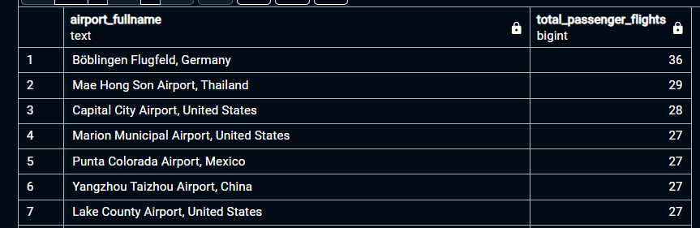
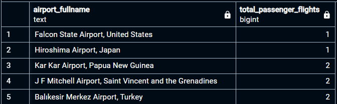
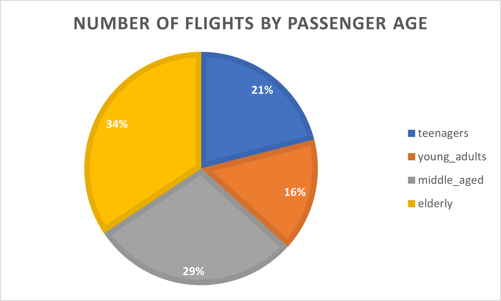
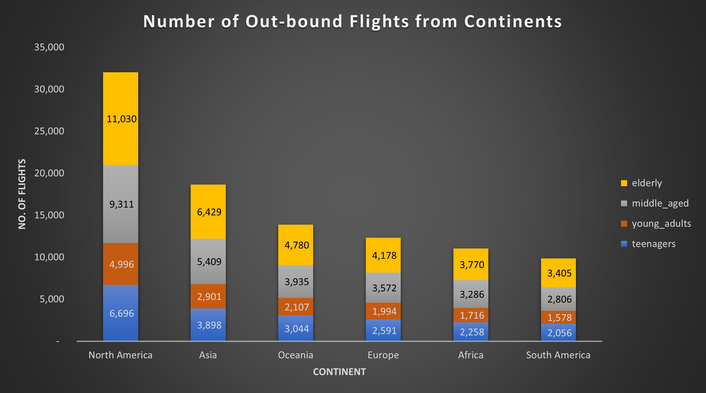
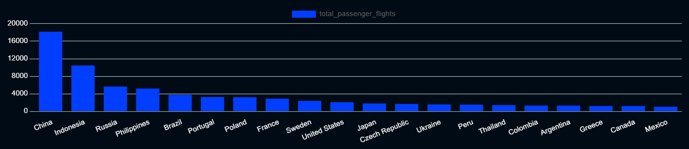
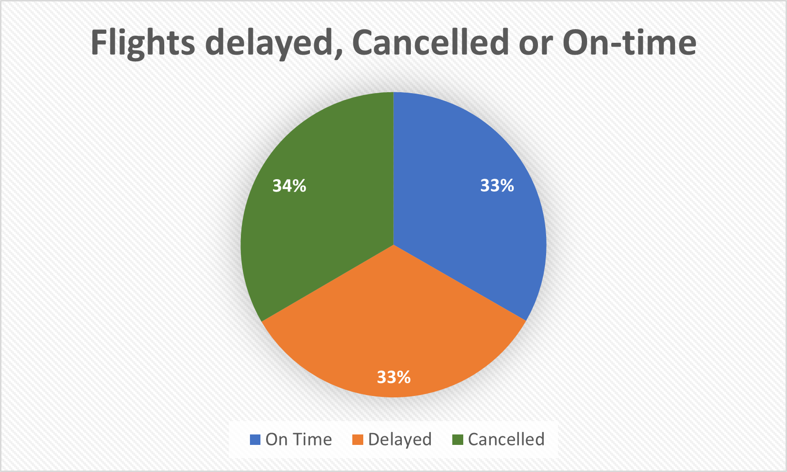
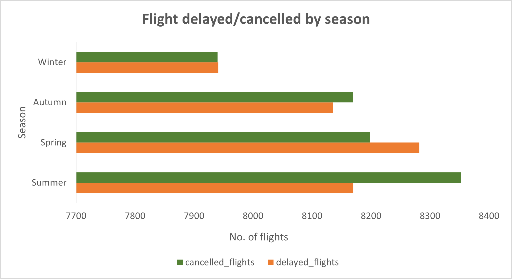
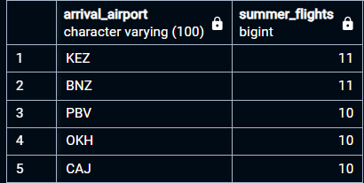

# Airline Data Analysis
___


## Description
The airline data holds immense importance, as it offers insights into the functioning and efficiency of the aviation industry. It provides valuable information about flight routes, schedules, passenger demographics, and preferences, which airlines can leverage to optimize their operations and enhance customer experiences.  

## Aim and Objectives
To provide insight on airline and general staff performance, identiifying potential areas of improvement. This will be achieved via: 
- Identifying most and least traveled airlines, including most visited destinations
- Customer segmentation based on demographics
- Analysing data on delays, cancellations, and on-time flights.  

Airlines can identify trends and implement strategies to improve punctuality and mitigate disruptions. Moreover, regulatory bodies and policymakers rely on this data to ensure safety standards, enforce regulations, and make informed decisions regarding aviation policies. Researchers and analysts use airline data to study market trends, assess environmental impacts, and develop strategies for sustainable growth within the industry.

## Table of Contents
___
- [Description](#description)
- [Aim and Objectives](#aim-and-objectives)
- [About the dataset](#about-the-dataset)
- [Dataset Glossary](#dataset-glossary)
- [Technologies](#technologies)
- [Data Sources](#data-sources)
- [Usage Instructions](#usage-instructions)
- [Data Cleaning and Preprocessing](#data-cleaning-and-preprocessing)
- [Data Analysis](#data-analysis)
- [Conclusion](#conclusion)
- [Further Improvement](#further-improvement)

## About the dataset
___
This dataset comprises diverse parameters relating to airline operations on a global scale. The dataset prominently incorporates fields such as Passenger ID, First Name, Last Name, Gender, Age, Nationality, Airport Name, Airport Country Code, Country Name, Airport Continent, Continents, Departure Date, Arrival Airport, Pilot Name, and Flight Status. 

These columns collectively provide comprehensive insights into passenger demographics, travel details, flight routes, crew information, and flight statuses. Researchers and industry experts can leverage this dataset to analyze trends in passenger behavior, optimize travel experiences, evaluate pilot performance, and enhance overall flight operations.

## Dataset Glossary
___
| Column | Description |
|--------|-------------|
| Passenger ID | Unique identifier for each passenger |  
First Name | First name of the passenger  
Last Name | Last name of the passenger  
Gender | Gender of the passenger  
Age | Age of the passenger  
Nationality | Nationality of the passenger  
Airport Name | Name of the airport where the passenger boarded  
Airport Country Code | Country code of the airport's location  
Country Name | Name of the country the airport is located in  
Airport Continent | Continent where the airport is situated  
Continents | Continents involved in the flight route  
Departure Date | Date when the flight departed  
Arrival Airport | Destination airport of the flight  
Pilot Name | Name of the pilot operating the flight  
Flight Status | Current status of the flight (e.g., on-time, delayed, canceled)  

## Technologies
___
* PostgreSQL (for data cleaning, analysis, and visualisation)
* MS Excel (for data visualisation)  

## Data Sources
___
Dataset was collected from a reputable airline database, showing details of flights from January to December 2022.  

## Usage Instructions
___
- Data analysis can be performed on any preferred Database Management System. However, the queries in this project was written in PostgreSQL. Take note of syntax.
- Download dataset file from this project repository into local machine. 
- On windows machine, enter ``` Windows + E ``` and paste the file path ```C:/ProgramData/MySQL/MySQL Server 8.0/Uploads``` on the file address to go into 'Uploads' folder.
- While in the 'Uploads' folder, create a folder named 'input_files' and copy the downloaded dataset files into this folder 
> [!CAUTION]
> You must perform all the steps above before running the SQL script.
- Open the "airline_data_analysis_queries.sql" file on your Database Management System and run the script. This should automatically create a database and table, and import the dataset into the table.
> [!WARNING]
> Run each block of code individually for better experience.

## Data Cleaning and Preprocessing
___
* Over 800 records with invalid 'arrival_airport' code (0) were deleted

## Data Analysis
___

### **1. Airports with the most travels**  


### **Key Insights and Recommendation**  
* Böblingen Flugfeld airport, Germany was the most frequently travelled airport (36 passenger flights).
This airport may require additional flights or larger aircraft to cater to the rising demand and
increase revenue. They may also require more staff and improved processes to manage potential traffic.
___

### **2. Least travelled airports**  


### **Key Insights and Recommendation**  
* Hiroshima Airport, Japan and Falcon State Airport, United States each had
the least flights (1 flight). This suggests a low demand for air travel in these regions
and a preference for more efficient alternative means of transportation e.g. railway.
* The geographical location and accessibility may also contribute to the low patronage.
* Strategies should be implemented to improve operational efficiency in these airports, or 
if necessary, resources may need to be reallocated to high-demand airports.
___  

### **3. Age brackets with the most travels**  
  

### **Key Insights and Recommendation**  
* Elderly passengers (60 yrs and above) made the most travels (33,592). While young adults (20 - 33 yrs) 
made the least (15,292).
* The elderly passengers majorly comprise people approaching retirement or even retired. 
They tend to have more savings and fewer job commitments. Hence may therefore make more holiday trips.
* Marketing and promotions should be targeted appropriately. In-flight experiences should be tailored 
to meet the preferences of the target demographics, improving customer satisfaction.
* It might be worth implementing bonuses and loyalty packages for this age bracket to retain them.
* The 'young adults' comprise mostly working-class individuals or university students.
This category of individuals invests more time at their jobs and studies/research, leaving less time for
frequent trips.
* Although this age bracket made the least trips according to our data, implementing 
student bonuses (especially during holidays) or business incentives may encourage more travel.
___  

### **4. Continents with the most outbound flight**  
  

### **Key Insights and Recommendation**  
* Elderly passengers (50 years and above) made the most travels across all continents.
Conversely, young adults (20 - 33 years) made the least number of trips across all continents.
* The highest number of trips were made from North American airports, and  the least number of flights from South American airports. 
* Several reasons may be responsible for this: One of which is a high demand for international
travel for business and leisure.
* In addition, a well-established and developed airline  infrastructure would encourage frequent trips. More so, North America appears to have a larger
number of middle-class people with the financial means to travel internationally
* Furthermore, many North Americans appear to have family ties abroad, possibly explaining the frequent international travel. Strategies (e.g., streamlined boarding) should be developed to 
improve services here, to enhance passenger experience.
* Flight prices may need to be reviewed downwards in the South America region, and incentives implemented to encourage sales.
___  

### **5. Nationalities with the most travels**  


### **Key Insights and Recommendation**  
* Chart (generated from PostgreSQL) showed that Chinese passengers made the most travels (18,160).
* Although previous query showed that the second-highest number of out-bound flights was recorded in Asia, the high number of Chinese making international trips
highlights the need to provide more aeroplanes and improve flight schedules for better customer satisfaction.
* Most aspects of the flight should be personalised for better customer experience. For example, a variety of Chinese
foods should be on the flight's menu; pamphlets can have Chinese translations too; a collection of Chinese movies should be available to watch aboard, etc.
* Targeted marketing and promotions should also be implemented to encourage more flights by Chinese.
___  

### **6. Number of flights delayed, cancelled and on-time**  


### **Key Insights and Recommendation**  
* Data showed the airlines had more flight cancellations (32,659 cancelled flights = 34%) compared to 
flights that were on time (32,559 flights on schedule = 33%) or delayed (32,528 delayed flights = 33%). 
* The airline management should aim to improve pilot punctuality and flight compliance with schedule.
* Also, management should aim to achieve a significant decline in the number of flights cancelled/delayed 
for better customer satisfaction.
___  

### **7. Seasons with the most delayed or cancelled flights**  


### **Key Insights and Recommendation**  
* The highest number of flights were made in Summer (24,902), and the least in Winter (23,781)
* Throughout the year, the most flight delays (8,282) were observed in the Spring (Mar-May),
and the least delays (7,941) in Winter (Dec - Feb).
* The highest number of flight cancellations (8,352) were observed in the Summer (June - Aug),
and the least cancellations (7,940) in Winter (Dec - Feb). High cancellations in the Summer 
may be due to staff shortages during this period, as staff tend to go on holidays in the Summer.
* Staffing levels, marketing, and operational resources should be adjusted to meet the demand in Summer. 
Also, flight schedules may need to be adjusted in Summer (peak season) to optimise seat availability.
* Promotions or discounts may need to be rolled out to help fill seats in Winter.
* In addition, holiday or seasonal promotions should be offered (targeted by region) 
such as flights to popular destinations during specific holidays.
___  

### **8. Arrival airport or destinations with the most visits in Summer**  


### **Key Insights and Recommendation**
* Airport KEZ and BNZ had the most visits during summer (11 flights), suggesting that these locations
might be hot spots for the Summer holidays. 
* Seasonal discounts and bonuses should be offered to customers travelling to these airports, especially during the Summer holidays, to encourage more trips.
___  

### **9. Airports with the most delayed flights**  

### **Key Insights and Recommendation**  
* Visby Airport, Sweden experienced the most flight delays (13 out of 21 flights).
* This high frequency of delays suggests that this airport may generate a lot of negative customer reviews and complaints.
* Strategies (e.g., streamlined boarding) should be developed to improve services here, to enhance passenger experience.
* In addition, communication strategies should be implemented/improved for potential delay-prone flights to proactively inform passengers.
___  

### **10. Airports with the most cancelled flights**  

### **Key Insights and Recommendation**  
* The highest (13) flight cancellations were experienced in the following airports:
  - Yangzhou Taizhou Airport in China (13 cancellations out of 27 passenger flights)
  - Mae Hong Son Airport in Thailand (13 cancellations out of 29 passenger flights)
  - Böblingen Flugfeld Airport in Germany (13 cancellations out of 36 passenger flights)

* Although it is not clear if these cancellations were initiated by the airport or if they were 
customer-initiated, the high cancellation rates suggest that this airport may also generate a lot of negative customer reviews and complaints.
* Strategies should be developed to improve services here, to enhance passenger experience.
___  

### **11. Pilots with the most delayed flights**  

### **Key Insights and Recommendation**  
* Ethan Desbrow and Demetris Atherley both had the highest number of delayed flights. All the flights they piloted were delayed.
* While several factors might be responsible for this, their performance suggests they may require extra training or support to improve performance.
___  

### **12. Top performing 20 pilots with the most 'on-schedule' flights**  

### **Key Insights and Recommendation**  
* Pilot Janela Eyres was the best-performing pilot, with all (2) flights on schedule. 
* This pilot should be given some incentive in the form of a bonus or pay rise, to encourage such performance.
* Implement several strategies to encourage optimum performance. For instance, design Key Performance Indices (KPI) and measure staff performance against these indices
Best performing staff should be rewarded with some incentives.
___  

## **Conclusion**  

This data shows Böblingen Flugfeld airport, Germany had the most travels while Hiroshima Airport, Japan, and Falcon State Airport, United States both had the least.
We also infer that airport KEZ and BNZ may be potential hot spots for the Summer holidays as they both had the most visits during summer.  

There is a need to improve processes and infrastructure in some of the airports, especially in Visby Airport, Sweden, as they recorded the highest flight delays. Yangzhou Taizhou Airport in China recorded the highest flight cancellations.
Our analysis also reveal elderly passengers (60 yrs and above) as the top customers for this airline comapny, and Janela Eyres as the best-performing pilot.  
___  

## **Further Improvements**  
This analysis is still ongoing. I hope to analyse this data on MS PowerBI, presenting an interactive dashboard for stakeholders to visualise and better appreciate the key insights. I am also open to suggestions on how to better improve my analysis. Thank you
___  
